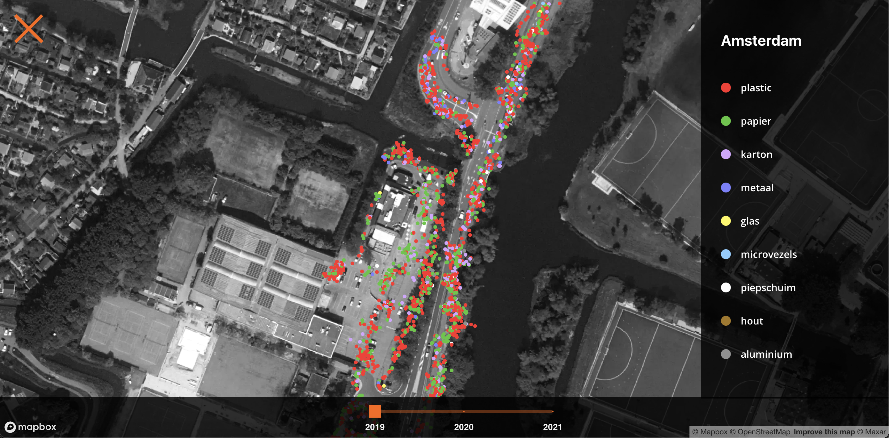

### Project Information Design

# Zwerfinator interactive map 

[Live preview](https://zwerfinator-eight.vercel.app)


## Table of contents
* [💡 Concept](https://github.com/jody29/zwerfinator_interactive_map/blob/main/README.md#-concept)
* [⚙️ Installation](https://github.com/jody29/zwerfinator_interactive_map#%EF%B8%8F-installation)
* [:pray: Wishlist](https://github.com/jody29/zwerfinator_interactive_map#pray-wishlist)
* [:white_check_mark: Assignment](https://github.com/jody29/zwerfinator_interactive_map#white_check_mark-rubric)
* [:information_source: Resources](https://github.com/jody29/zwerfinator_interactive_map#information_source-resources)
* [:copyright: License](https://github.com/jody29/zwerfinator_interactive_map#copyright-license)

## 💡 Concept
The concept for this project is to render a map of all the municipalities in the Netherlands. Every municipality gets a color which represents the percentage of people who are vaccinated in that municipality. This will show in which municipalities the most people are vaccinated. This will also show which municipalities have a low vaccination percentage

## ⚙️ Installation
Clone the repo to your own device
```bash
$ git clone https://github.com/jody29/zwerfinator_interactive_map.git
```
install the npm dependencies
```bash
$ npm install
```
run the server on your browser
```bash
$ npm start
```

## :pray: Wishlist
* A possibility that users can filter on the materials per location.


## :white_check_mark: Assignment
Create a client-side application in JavaScript which dynamically renders data to views using either a front-end framework or system created by you. Reflect on the merits and costs of frameworks together.


## :information_source: Resources
### Credits
* All the coaches from Project Information Design.
* Dirk Groot, aka zwerfinator.

### data sources
* Vaccination data by RIVM: [vaccination](https://data.rivm.nl/covid-19/COVID-19_vaccinatiegraad_per_gemeente_per_week_leeftijd.json)
* Topojson from the dutch [ministry of health welfare and sport](https://github.com/minvws): [topojson](https://github.com/minvws/nl-covid19-data-dashboard/blob/develop/packages/app/src/components/choropleth/logic/nl-vr-gm.topo.json)


## :copyright: License
